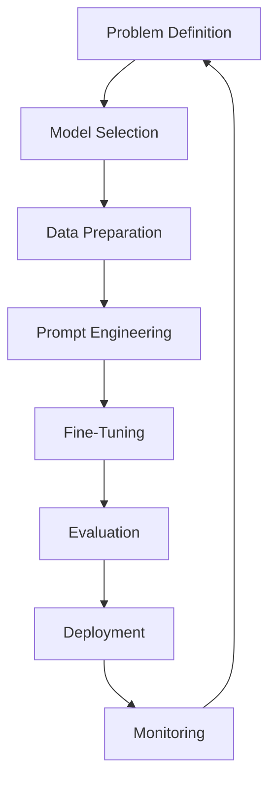
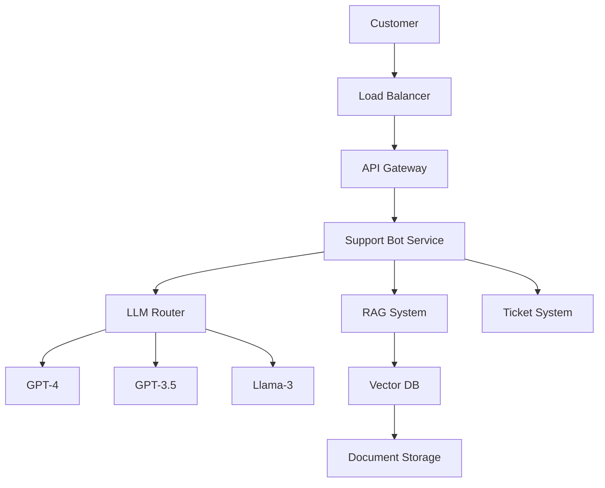

# LLMOps Lifecycle: A Comprehensive Guide from Beginner to Advanced

This guide covers the complete Large Language Model Operations (LLMOps) lifecycle, from initial planning to continuous improvement, with practical examples and code snippets.

## Table of Contents
1. [Introduction to LLMOps](#introduction-to-llmops)
2. [Problem Definition & Use Case Selection](#problem-definition--use-case-selection)
3. [Model Selection & Procurement](#model-selection--procurement)
4. [Data Preparation](#data-preparation)
5. [Prompt Engineering](#prompt-engineering)
6. [Fine-Tuning](#fine-tuning)
7. [Evaluation](#evaluation)
8. [Deployment](#deployment)
9. [Monitoring & Optimization](#monitoring--optimization)
10. [Advanced LLMOps](#advanced-llmops)
11. [End-to-End Example Project](#end-to-end-example-project)

## Introduction to LLMOps

LLMOps is the specialized practice of operationalizing large language models, combining elements of MLOps with unique considerations for LLMs.

### Key Differences from Traditional MLOps:
- Prompt engineering as a first-class skill
- Different evaluation metrics
- Unique deployment challenges
- Specialized optimization techniques
- Higher computational costs



## Problem Definition & Use Case Selection

**Objective:** Identify high-value LLM applications aligned with business goals.

### Key Activities:
- Opportunity assessment
- Feasibility analysis
- Success metric definition
- Risk assessment

### Example Use Case Canvas:

```markdown
# Customer Support Assistant

## Business Value:
- Reduce support ticket volume by 40%
- Improve customer satisfaction scores
- Enable 24/7 support availability

## Technical Feasibility:
- Requires understanding of product documentation
- Needs to handle common troubleshooting
- Must recognize when to escalate to humans

## Success Metrics:
- Accuracy: 85% correct answers
- Deflection Rate: 40% of tickets resolved without human
- CSAT: Maintain or improve current scores

## Risks:
- Hallucinations providing wrong information
- Offensive/inappropriate responses
- Data privacy concerns
```

### Example ROI Calculation:

```python
def calculate_llm_roi(tickets_per_month, avg_handle_time, agent_cost_per_hour, 
                     expected_deflection_rate, implementation_cost):
    """
    Calculate ROI for support bot implementation
    
    Args:
        tickets_per_month: Current ticket volume
        avg_handle_time: Average handling time in hours
        agent_cost_per_hour: Fully loaded agent cost
        expected_deflection_rate: % tickets handled by bot
        implementation_cost: Total implementation cost
        
    Returns:
        Dictionary with ROI metrics
    """
    monthly_savings = (tickets_per_month * expected_deflection_rate * 
                      avg_handle_time * agent_cost_per_hour)
    payback_months = implementation_cost / monthly_savings
    annual_savings = monthly_savings * 12
    
    return {
        'monthly_savings': monthly_savings,
        'payback_period_months': payback_months,
        'annual_savings': annual_savings,
        'roi_first_year': (annual_savings - implementation_cost) / implementation_cost
    }

# Example usage
print(calculate_llm_roi(5000, 0.25, 30, 0.4, 75000))
```

## Model Selection & Procurement

**Objective:** Choose the right LLM for your use case.

### Considerations:
- Open-source vs proprietary
- Model size vs performance
- Cost structure
- Latency requirements

### Model Comparison Framework:

```python
def evaluate_llm_options(use_case_requirements):
    """
    Evaluate LLM options against requirements
    
    Args:
        use_case_requirements: Dict of requirements
        
    Returns:
        DataFrame with scored options
    """
    models = {
        'GPT-4': {
            'max_context': 128000,
            'cost_per_1k_input': 0.03,
            'cost_per_1k_output': 0.06,
            'latency': 300,
            'knowledge_cutoff': '2023-12',
            'fine_tunable': False
        },
        'Claude-3-Opus': {
            'max_context': 200000,
            'cost_per_1k_input': 0.015,
            'cost_per_1k_output': 0.075,
            'latency': 400,
            'knowledge_cutoff': '2023-12',
            'fine_tunable': False
        },
        'Llama-3-70B': {
            'max_context': 8000,
            'cost_per_1k_input': 0.001,  # Self-hosted estimate
            'cost_per_1k_output': 0.001,
            'latency': 150,
            'knowledge_cutoff': '2023-09',
            'fine_tunable': True
        }
    }
    
    # Score each model (simplified example)
    scores = {}
    for model, specs in models.items():
        score = 0
        
        # Context window
        if specs['max_context'] >= use_case_requirements.get('min_context', 4000):
            score += 1
            
        # Cost
        if (specs['cost_per_1k_input'] + specs['cost_per_1k_output']) < 0.05:
            score += 1
            
        # Add more criteria...
        
        scores[model] = score
    
    return scores

# Example usage
requirements = {
    'min_context': 8000,
    'max_cost_per_1k': 0.05,
    'requires_fine_tuning': True
}
print(evaluate_llm_options(requirements))
```

## Data Preparation

**Objective:** Prepare high-quality data for prompting and fine-tuning.

### Key Activities:
- Data collection
- Cleaning and formatting
- Annotation
- Chunking for context windows

### Example Data Preparation Pipeline:

```python
from datasets import load_dataset
import pandas as pd
import re

def prepare_support_data():
    """Prepare customer support data for LLM training"""
    # Load raw data
    dataset = load_dataset("customer_support_tickets")
    df = pd.DataFrame(dataset['train'])
    
    # Clean text
    df['clean_text'] = df['text'].apply(lambda x: re.sub(r'\s+', ' ', x.strip()))
    
    # Create prompt-completion pairs
    df['prompt'] = "Customer question: " + df['question']
    df['completion'] = "Support answer: " + df['answer']
    
    # Split into chunks that fit context window
    max_length = 4000  # Adjust based on model
    df['token_count'] = df['prompt'].apply(lambda x: len(x.split()))
    df = df[df['token_count'] <= max_length]
    
    # Format for fine-tuning
    formatted_data = df[['prompt', 'completion']].to_dict('records')
    
    return formatted_data

def create_rag_documents():
    """Prepare documents for retrieval-augmented generation"""
    knowledge_base = load_dataset("product_documentation")
    
    # Split into chunks with overlap
    chunk_size = 1000  # tokens/characters
    overlap = 200
    
    chunks = []
    for doc in knowledge_base:
        text = doc['content']
        for i in range(0, len(text), chunk_size - overlap):
            chunk = text[i:i+chunk_size]
            chunks.append({
                'text': chunk,
                'metadata': {
                    'source': doc['source'],
                    'page': doc['page']
                }
            })
    
    return chunks
```

## Prompt Engineering

**Objective:** Craft effective prompts to maximize model performance.

### Techniques:
- Zero-shot vs few-shot prompting
- Chain-of-thought
- Template design
- Instruction tuning

### Example Prompt Template System:

```python
class SupportPromptEngine:
    def __init__(self):
        self.base_prompt = """You are an expert customer support agent for {company_name}. 
        Provide helpful, accurate responses to customer inquiries using only the provided context.
        If you don't know the answer, say "I'll need to check with a colleague about that."
        
        Company values:
        - Be polite and professional
       - Always verify facts before responding
        - Never make up information
        
        Context:
        {context}
        
        Customer question: {question}
        
        Answer:"""
        
        self.few_shot_examples = [
            {
                "question": "How do I reset my password?",
                "answer": "You can reset your password by visiting our login page and clicking 'Forgot password'. You'll receive an email with reset instructions."
            },
            {
                "question": "When will my order ship?",
                "answer": "Most orders ship within 1-2 business days. You'll receive a tracking email once your order ships."
            }
        ]
    
    def build_prompt(self, question, context=None, company_name="Acme Inc"):
        """Construct optimized prompt"""
        # Add few-shot examples if helpful
        examples = "\n\n".join(
            f"Customer question: {ex['question']}\nAnswer: {ex['answer']}"
            for ex in self.few_shot_examples
        )
        
        full_prompt = self.base_prompt.format(
            company_name=company_name,
            context=context or "No additional context provided",
            question=question
        )
        
        return f"{examples}\n\n{full_prompt}" if examples else full_prompt

# Usage
prompt_engine = SupportPromptEngine()
print(prompt_engine.build_prompt("How do I return a product?"))
```

## Fine-Tuning

**Objective:** Adapt base LLM to your specific domain and use case.

### Approaches:
- Full fine-tuning
- Parameter-efficient methods (LoRA, QLoRA)
- Instruction tuning
- Reinforcement Learning from Human Feedback (RLHF)

### Example Fine-Tuning Script (LoRA):

```python
from transformers import AutoModelForCausalLM, AutoTokenizer, TrainingArguments
from peft import LoraConfig, get_peft_model
from trl import SFTTrainer
import torch

def fine_tune_llm():
    # Load base model
    model_name = "meta-llama/Llama-3-8B"
    tokenizer = AutoTokenizer.from_pretrained(model_name)
    model = AutoModelForCausalLM.from_pretrained(
        model_name,
        torch_dtype=torch.bfloat16,
        device_map="auto"
    )
    
    # Add LoRA adapters
    peft_config = LoraConfig(
        r=8,
        lora_alpha=16,
        lora_dropout=0.05,
        bias="none",
        task_type="CAUSAL_LM",
        target_modules=["q_proj", "v_proj"]
    )
    model = get_peft_model(model, peft_config)
    
    # Training setup
    training_args = TrainingArguments(
        output_dir="./results",
        per_device_train_batch_size=4,
        gradient_accumulation_steps=4,
        learning_rate=2e-5,
        num_train_epochs=3,
        logging_dir="./logs",
        logging_steps=10,
        save_strategy="epoch",
        fp16=True,
        push_to_hub=False
    )
    
    # Prepare data
    train_data = prepare_support_data()  # From previous section
    
    # Initialize trainer
    trainer = SFTTrainer(
        model=model,
        args=training_args,
        train_dataset=train_data,
        dataset_text_field="text",
        max_seq_length=2048,
        tokenizer=tokenizer
    )
    
    # Train
    trainer.train()
    
    # Save
    model.save_pretrained("./fine_tuned_model")
    tokenizer.save_pretrained("./fine_tuned_model")

if __name__ == "__main__":
    fine_tune_llm()
```

## Evaluation

**Objective:** Assess model performance comprehensively.

### Evaluation Types:
- Automated metrics
- Human evaluation
- A/B testing
- Adversarial testing

### Example Evaluation Framework:

```python
from sklearn.metrics import accuracy_score, f1_score
import numpy as np
import openai

class LLMEvaluator:
    def __init__(self, model, tokenizer=None):
        self.model = model
        self.tokenizer = tokenizer
    
    def evaluate_accuracy(self, test_dataset):
        """Calculate accuracy on test set"""
        preds = []
        truths = []
        
        for example in test_dataset:
            if isinstance(self.model, str):  # API model
                response = openai.ChatCompletion.create(
                    model=self.model,
                    messages=[{"role": "user", "content": example['prompt']}]
                )
                pred = response.choices[0].message.content
            else:  # Local model
                inputs = self.tokenizer(example['prompt'], return_tensors="pt")
                outputs = self.model.generate(**inputs)
                pred = self.tokenizer.decode(outputs[0], skip_special_tokens=True)
            
            preds.append(pred)
            truths.append(example['completion'])
        
        # Simple exact match accuracy
        accuracy = accuracy_score(truths, preds)
        f1 = f1_score(truths, preds, average='weighted')
        
        return {'accuracy': accuracy, 'f1_score': f1}
    
    def evaluate_quality(self, responses):
        """Use LLM to evaluate response quality"""
        evaluation_prompt = """Evaluate this customer support response:
        
        Question: {question}
        Response: {response}
        
        Rate 1-5 on:
        - Accuracy
        - Clarity
        - Professionalism
        - Helpfulness
        
        Provide brief explanations for each rating:"""
        
        evaluations = []
        for item in responses:
            prompt = evaluation_prompt.format(
                question=item['question'],
                response=item['response']
            )
            
            eval_response = openai.ChatCompletion.create(
                model="gpt-4",
                messages=[{"role": "user", "content": prompt}],
                temperature=0
            )
            evaluations.append(eval_response.choices[0].message.content)
        
        return evaluations

# Example usage
evaluator = LLMEvaluator("gpt-3.5-turbo")
test_data = load_test_dataset()
print(evaluator.evaluate_accuracy(test_data))
```

## Deployment

**Objective:** Serve LLM in production reliably and cost-effectively.

### Deployment Options:
- API endpoints
- Edge deployment
- Serverless functions
- Batch processing

### Example FastAPI Deployment:

```python
from fastapi import FastAPI, HTTPException
from pydantic import BaseModel
import openai
import os

app = FastAPI()

# Configuration
MODEL_NAME = os.getenv("LLM_MODEL", "gpt-3.5-turbo")
MAX_TOKENS = int(os.getenv("MAX_TOKENS", 1000))
TEMPERATURE = float(os.getenv("TEMPERATURE", 0.7))

class Query(BaseModel):
    question: str
    context: str = None
    conversation_history: list = []

@app.post("/answer")
async def generate_answer(query: Query):
    try:
        # Build prompt
        prompt_engine = SupportPromptEngine()
        prompt = prompt_engine.build_prompt(
            question=query.question,
            context=query.context,
            company_name="Acme Inc"
        )
        
        # Call LLM
        response = openai.ChatCompletion.create(
            model=MODEL_NAME,
            messages=[{"role": "user", "content": prompt}],
            max_tokens=MAX_TOKENS,
            temperature=TEMPERATURE,
            timeout=10
        )
        
        return {
            "answer": response.choices[0].message.content,
            "model": MODEL_NAME,
            "tokens_used": response.usage['total_tokens']
        }
    except Exception as e:
        raise HTTPException(status_code=500, detail=str(e))

# Dockerfile would include:
# FROM python:3.9
# COPY . /app
# WORKDIR /app
# RUN pip install -r requirements.txt
# CMD ["uvicorn", "app:app", "--host", "0.0.0.0", "--port", "8000"]
```

### Example Kubernetes Deployment with Auto-Scaling:

```yaml
# deployment.yaml
apiVersion: apps/v1
kind: Deployment
metadata:
  name: llm-api
spec:
  replicas: 2
  selector:
    matchLabels:
      app: llm-api
  template:
    metadata:
      labels:
        app: llm-api
    spec:
      containers:
      - name: llm-api
        image: your-registry/llm-api:latest
        ports:
        - containerPort: 8000
        resources:
          requests:
            cpu: "1000m"
            memory: "2Gi"
          limits:
            cpu: "2000m"
            memory: "4Gi"
        env:
        - name: LLM_MODEL
          value: "gpt-3.5-turbo"
        - name: MAX_TOKENS
          value: "1000"
---
apiVersion: autoscaling/v2
kind: HorizontalPodAutoscaler
metadata:
  name: llm-api-hpa
spec:
  scaleTargetRef:
    apiVersion: apps/v1
    kind: Deployment
    name: llm-api
  minReplicas: 2
  maxReplicas: 10
  metrics:
  - type: Resource
    resource:
      name: cpu
      target:
        type: Utilization
        averageUtilization: 70
```

## Monitoring & Optimization

**Objective:** Track performance and optimize cost/quality tradeoffs.

### Key Metrics:
- Latency
- Cost per query
- Quality drift
- Error rates

### Example Monitoring Dashboard:

```python
from prometheus_client import start_http_server, Summary, Counter, Gauge
import time
import logging

# Create metrics
REQUEST_LATENCY = Summary('request_latency_seconds', 'Response latency')
REQUEST_COUNT = Counter('total_requests', 'Total requests served')
ERROR_COUNT = Counter('error_requests', 'Error responses')
COST_TRACKER = Gauge('cost_usd', 'Estimated API costs')
QUALITY_SCORE = Gauge('response_quality', 'Average quality score (0-1)')

class LLMMonitor:
    def __init__(self):
        self.cost_per_token = {
            'input': 0.0015/1000,
            'output': 0.002/1000
        }
        self.total_cost = 0
    
    def track_request(self, start_time, response=None, error=False):
        # Calculate latency
        latency = time.time() - start_time
        REQUEST_LATENCY.observe(latency)
        REQUEST_COUNT.inc()
        
        if error:
            ERROR_COUNT.inc()
        elif response:
            # Track costs
            input_cost = response.usage['prompt_tokens'] * self.cost_per_token['input']
            output_cost = response.usage['completion_tokens'] * self.cost_per_token['output']
            total_cost = input_cost + output_cost
            self.total_cost += total_cost
            COST_TRACKER.set(self.total_cost)
            
            # Track quality (simplified)
            quality = self.estimate_quality(response.choices[0].message.content)
            QUALITY_SCORE.set(quality)
    
    def estimate_quality(self, response):
        """Simple heuristic for response quality"""
        # In practice, use proper evaluation
        if len(response) < 10:
            return 0.2
        if "I don't know" in response:
            return 0.5
        return 0.9

# Example usage in API endpoint
monitor = LLMMonitor()

@app.post("/answer")
async def generate_answer(query: Query):
    start_time = time.time()
    try:
        response = openai.ChatCompletion.create(...)
        monitor.track_request(start_time, response=response)
        return response
    except Exception as e:
        monitor.track_request(start_time, error=True)
        raise HTTPException(...)
```

## Advanced LLMOps

### Retrieval-Augmented Generation (RAG) Implementation:

```python
from langchain.vectorstores import Chroma
from langchain.embeddings import OpenAIEmbeddings
from langchain.text_splitter import RecursiveCharacterTextSplitter
from langchain.document_loaders import DirectoryLoader

class RAGSystem:
    def __init__(self):
        self.embeddings = OpenAIEmbeddings()
        self.text_splitter = RecursiveCharacterTextSplitter(
            chunk_size=1000,
            chunk_overlap=200
        )
        self.vectorstore = None
    
    def build_knowledge_base(self, docs_path):
        """Create vector store from documents"""
        loader = DirectoryLoader(docs_path)
        documents = loader.load()
        chunks = self.text_splitter.split_documents(documents)
        
        self.vectorstore = Chroma.from_documents(
            chunks,
            self.embeddings,
            persist_directory="./chroma_db"
        )
        return len(chunks)
    
    def retrieve_relevant_docs(self, query, k=3):
        """Retrieve most relevant documents"""
        if not self.vectorstore:
            raise ValueError("Knowledge base not initialized")
        
        docs = self.vectorstore.similarity_search(query, k=k)
        return "\n\n".join(d.page_content for d in docs)

# Usage
rag = RAGSystem()
rag.build_knowledge_base("./product_docs")
context = rag.retrieve_relevant_docs("How do I reset my password?")
```

### LLM CI/CD Pipeline (GitHub Actions):

```yaml
name: LLM Pipeline

on:
  push:
    branches: [ main ]
  pull_request:
    branches: [ main ]

jobs:
  test-prompts:
    runs-on: ubuntu-latest
    steps:
    - uses: actions/checkout@v3
    - name: Run prompt tests
      run: |
        pip install -r requirements.txt
        python -m pytest tests/prompt_tests.py
        
  evaluate-model:
    needs: test-prompts
    runs-on: ubuntu-latest
    steps:
    - uses: actions/checkout@v3
    - name: Evaluate model
      run: |
        python evaluate.py --model gpt-3.5-turbo --dataset test_data.json
      env:
        OPENAI_API_KEY: ${{ secrets.OPENAI_API_KEY }}
        
  deploy:
    needs: evaluate-model
    runs-on: ubuntu-latest
    steps:
    - uses: actions/checkout@v3
    - name: Build and push Docker image
      run: |
        docker build -t llm-api .
        docker tag llm-api your-registry/llm-api:${{ github.sha }}
        docker push your-registry/llm-api:${{ github.sha }}
    - name: Deploy to Kubernetes
      run: |
        kubectl set image deployment/llm-api llm-api=your-registry/llm-api:${{ github.sha }}
```

## End-to-End Example Project

### Customer Support Chatbot Implementation

**1. Problem Definition:**
- Automate tier-1 customer support
- Reduce response time from hours to minutes
- Maintain brand voice and accuracy

**2. Model Selection:**
- GPT-4 for high accuracy
- Fallback to GPT-3.5-turbo for simple queries
- Llama-3 for PII-sensitive questions

**3. Data Pipeline:**

```python
# data_pipeline.py
def prepare_training_data():
    # Load historical support tickets
    tickets = pd.read_csv("support_tickets.csv")
    
    # Filter and clean
    tickets = tickets[tickets['resolution'].notna()]
    tickets['question'] = tickets['subject'] + " " + tickets['description']
    tickets['answer'] = tickets['resolution']
    
    # Create train/val split
    train, val = train_test_split(tickets, test_size=0.2)
    
    # Format for fine-tuning
    train_data = train[['question', 'answer']].to_dict('records')
    val_data = val[['question', 'answer']].to_dict('records')
    
    return train_data, val_data
```

**4. Prompt Engineering System:**

```python
# prompting.py
class SupportPromptBuilder:
    def __init__(self):
        self.templates = {
            "general": """Answer this customer support question:
Question: {question}
Context: {context}
Answer in 2-3 sentences, professionally but friendly:""",
            
            "technical": """[For technical issues only]
Diagnose and suggest solutions for:
Problem: {question}
Error messages: {error_messages}
Possible solutions:"""
        }
    
    def build_prompt(self, ticket):
        # Determine prompt type
        if "error" in ticket['subject'].lower() or "bug" in ticket['description'].lower():
            prompt_type = "technical"
        else:
            prompt_type = "general"
        
        # Get relevant context
        context = self._get_context(ticket)
        
        # Format prompt
        return self.templates[prompt_type].format(
            question=ticket['description'],
            context=context,
            error_messages=ticket.get('error_logs', '')
        )
    
    def _get_context(self, ticket):
        # In practice, would retrieve from knowledge base
        return "Product version: 2.1\nKnown issues: ..."
```

**5. Evaluation Framework:**

```python
# evaluation.py
class SupportEvaluator:
    def __init__(self):
        self.metrics = {
            'accuracy': [],
            'helpfulness': [],
            'time_saved': 0
        }
    
    def log_human_evaluation(self, ticket_id, evaluation):
        """Record human quality assessments"""
        self.metrics['accuracy'].append(evaluation['accuracy'])
        self.metrics['helpfulness'].append(evaluation['helpfulness'])
    
    def calculate_savings(self, resolved_tickets):
        """Estimate time savings"""
        avg_handle_time = 12  # minutes
        self.metrics['time_saved'] = len(resolved_tickets) * avg_handle_time
    
    def generate_report(self):
        """Create summary report"""
        return {
            'avg_accuracy': np.mean(self.metrics['accuracy']),
            'avg_helpfulness': np.mean(self.metrics['helpfulness']),
            'total_time_saved': self.metrics['time_saved'],
            'deflection_rate': len(self.metrics['accuracy']) / 
                             (len(self.metrics['accuracy']) + self.metrics.get('escalations', 0))
        }
```

**6. Deployment Architecture:**



**7. Monitoring Dashboard:**

```python
# monitoring_dashboard.py
import streamlit as st
import pandas as pd
import plotly.express as px

def show_dashboard(metrics):
    st.title("LLM Support Bot Dashboard")
    
    # Key metrics
    col1, col2, col3 = st.columns(3)
    col1.metric("Deflection Rate", f"{metrics['deflection_rate']:.1%}")
    col2.metric("Avg Accuracy", f"{metrics['avg_accuracy']:.1%}")
    col3.metric("Time Saved", f"{metrics['time_saved']/60:.1f} hours")
    
    # Accuracy over time
    st.subheader("Accuracy Trend")
    acc_df = pd.DataFrame(metrics['accuracy_history'])
    fig = px.line(acc_df, x='date', y='accuracy')
    st.plotly_chart(fig)
    
    # Cost analysis
    st.subheader("Cost Breakdown")
    cost_df = pd.DataFrame({
        'Model': ['GPT-4', 'GPT-3.5', 'Llama-3'],
        'Cost': metrics['model_costs']
    })
    st.bar_chart(cost_df.set_index('Model'))
```

## Conclusion

LLMOps is a rapidly evolving discipline that requires balancing technical implementation with business objectives. This guide has walked you through the complete lifecycle from problem definition to continuous monitoring.

### Key Takeaways:
1. LLMOps extends beyond traditional MLOps with prompt engineering and specialized evaluation
2. Model selection should balance cost, performance, and requirements
3. Continuous monitoring is crucial for quality and cost control
4. RAG systems can significantly improve accuracy
5. Human-in-the-loop processes are often necessary for high-stakes applications

### Next Steps:
1. Implement a small-scale LLM application
2. Experiment with different prompting techniques
3. Explore fine-tuning open-source models
4. Set up monitoring for an existing LLM application
5. Stay current with the fast-moving LLM ecosystem

Remember that successful LLMOps requires both technical excellence and close collaboration with business stakeholders. Happy building!


# Next Steps for Your LLMOps Journey

Here's a concrete action plan to help you progress from beginner to advanced LLMOps practitioner:

## Immediate Next Steps (Week 1)

### 1. Set Up Your Development Environment
```bash
# Create a new project directory
mkdir llmops-project && cd llmops-project

# Set up Python environment (Python 3.9+ recommended)
python -m venv venv
source venv/bin/activate  # On Windows: venv\Scripts\activate

# Install essential packages
pip install openai langchain chromadb transformers datasets pandas numpy
pip install fastapi uvicorn  # For API development
```

### 2. Run Your First LLM Experiment
Create `first_experiment.py`:
```python
import openai
from getpass import getpass

# Set your API key
openai.api_key = getpass("Enter your OpenAI API key: ")

def basic_chat(prompt):
    response = openai.ChatCompletion.create(
        model="gpt-3.5-turbo",
        messages=[{"role": "user", "content": prompt}],
        temperature=0.7
    )
    return response.choices[0].message.content

# Test it
print(basic_chat("Explain LLMOps in simple terms"))
```

## Week 2-3: Build Your First LLM Application

### 3. Create a Simple Support Bot
Build `support_bot.py`:
```python
from typing import List
from fastapi import FastAPI
from pydantic import BaseModel

app = FastAPI()

class Conversation(BaseModel):
    history: List[dict]
    new_question: str

@app.post("/support")
async def support_response(conversation: Conversation):
    prompt = """You are a customer support agent. Answer professionally but friendly.
    
    Conversation history:
    {history}
    
    New question: {question}
    
    Answer:""".format(
        history="\n".join(f"{msg['role']}: {msg['content']}" 
                         for msg in conversation.history),
        question=conversation.new_question
    )
    
    response = openai.ChatCompletion.create(
        model="gpt-3.5-turbo",
        messages=[{"role": "user", "content": prompt}],
        temperature=0.5
    )
    
    return {"response": response.choices[0].message.content}
```

### 4. Containerize Your Application
Create `Dockerfile`:
```dockerfile
FROM python:3.9-slim

WORKDIR /app

COPY requirements.txt .
RUN pip install --no-cache-dir -r requirements.txt

COPY . .

CMD ["uvicorn", "support_bot:app", "--host", "0.0.0.0", "--port", "8000"]
```

## Month 1: Intermediate Projects

### 5. Implement RAG System
Create `rag_system.py`:
```python
from langchain.document_loaders import WebBaseLoader
from langchain.text_splitter import RecursiveCharacterTextSplitter
from langchain.embeddings import OpenAIEmbeddings
from langchain.vectorstores import Chroma

# Load your knowledge base
loader = WebBaseLoader(["https://your-product-docs.com"])
docs = loader.load()

# Split documents
text_splitter = RecursiveCharacterTextSplitter(chunk_size=1000, chunk_overlap=200)
splits = text_splitter.split_documents(docs)

# Create vector store
vectorstore = Chroma.from_documents(
    documents=splits,
    embedding=OpenAIEmbeddings(),
    persist_directory="./chroma_db"
)

# Query example
query = "How do I reset my password?"
docs = vectorstore.similarity_search(query)
print(docs[0].page_content)
```

### 6. Set Up Basic Monitoring
Create `monitoring.py`:
```python
from prometheus_client import start_http_server, Counter, Histogram
import time

# Metrics
REQUEST_COUNT = Counter('request_count', 'Total API requests')
ERROR_COUNT = Counter('error_count', 'Total errors')
LATENCY = Histogram('request_latency_seconds', 'Request latency')

def monitor_request(func):
    def wrapper(*args, **kwargs):
        start_time = time.time()
        REQUEST_COUNT.inc()
        
        try:
            response = func(*args, **kwargs)
            LATENCY.observe(time.time() - start_time)
            return response
        except Exception as e:
            ERROR_COUNT.inc()
            raise e
    
    return wrapper

# Start metrics server
start_http_server(8001)
```

## Month 2-3: Advanced Implementation

### 7. Implement Fine-Tuning Pipeline
Create `fine_tuning.py`:
```python
from datasets import load_dataset
from transformers import AutoTokenizer, TrainingArguments
from transformers import AutoModelForCausalLM, Trainer

# Load dataset
dataset = load_dataset("your-support-dataset")

# Load tokenizer and model
tokenizer = AutoTokenizer.from_pretrained("meta-llama/Llama-3-8B")
model = AutoModelForCausalLM.from_pretrained("meta-llama/Llama-3-8B")

# Tokenize data
def tokenize_function(examples):
    return tokenizer(examples["text"], padding="max_length", truncation=True)

tokenized_datasets = dataset.map(tokenize_function, batched=True)

# Training setup
training_args = TrainingArguments(
    output_dir="./results",
    evaluation_strategy="epoch",
    learning_rate=2e-5,
    per_device_train_batch_size=4,
    num_train_epochs=3,
)

trainer = Trainer(
    model=model,
    args=training_args,
    train_dataset=tokenized_datasets["train"],
    eval_dataset=tokenized_datasets["test"],
)

# Start training
trainer.train()
```

### 8. Build CI/CD Pipeline
Create `.github/workflows/mlops-pipeline.yml`:
```yaml
name: LLMOps Pipeline

on: [push]

jobs:
  test:
    runs-on: ubuntu-latest
    steps:
    - uses: actions/checkout@v2
    - name: Set up Python
      uses: actions/setup-python@v2
      with:
        python-version: '3.9'
    - name: Install dependencies
      run: |
        python -m pip install --upgrade pip
        pip install -r requirements.txt
    - name: Run tests
      run: |
        pytest tests/

  deploy:
    needs: test
    runs-on: ubuntu-latest
    steps:
    - uses: actions/checkout@v2
    - name: Build and push Docker image
      run: |
        docker build -t your-username/llm-app .
        echo "${{ secrets.DOCKER_PASSWORD }}" | docker login -u "${{ secrets.DOCKER_USERNAME }}" --password-stdin
        docker push your-username/llm-app
    - name: Deploy to Kubernetes
      run: |
        kubectl set image deployment/llm-app llm-app=your-username/llm-app:${{ github.sha }}
```

## Ongoing Learning Path

### 9. Recommended Learning Resources

#### Books:
- "Building LLM Powered Applications" by Valentina Alto
- "Prompt Engineering for Generative AI" by James Phoenix

#### Online Courses:
- [DeepLearning.AI's ChatGPT Prompt Engineering for Developers](https://www.deeplearning.ai/short-courses/chatgpt-prompt-engineering-for-developers/)
- [Full Stack LLM Bootcamp](https://fullstackdeeplearning.com/llm-bootcamp)

#### Tools to Master:
1. **Prompt Engineering**: LangChain, Semantic Kernel
2. **Vector Databases**: Pinecone, Weaviate, Chroma
3. **Monitoring**: Arize, WhyLabs, Prometheus
4. **Orchestration**: Airflow, Prefect, Kubeflow

### 10. Join the Community

#### Forums:
- [LLMOps Discord Community](https://discord.gg/llmops)
- [r/MachineLearning on Reddit](https://www.reddit.com/r/MachineLearning/)

#### Conferences:
- LLM Summit (virtual)
- Applied ML Summit

## Final Recommendation

Start with this progression:

1. **Week 1-2**: Implement the basic support bot with FastAPI
2. **Week 3-4**: Add RAG capabilities with your own documentation
3. **Month 2**: Implement monitoring and basic analytics
4. **Month 3**: Set up CI/CD pipeline for your application
5. **Ongoing**: Experiment with one new advanced technique each month (fine-tuning, RLHF, etc.)

Would you like me to elaborate on any specific part of this roadmap or provide additional code examples for a particular stage?