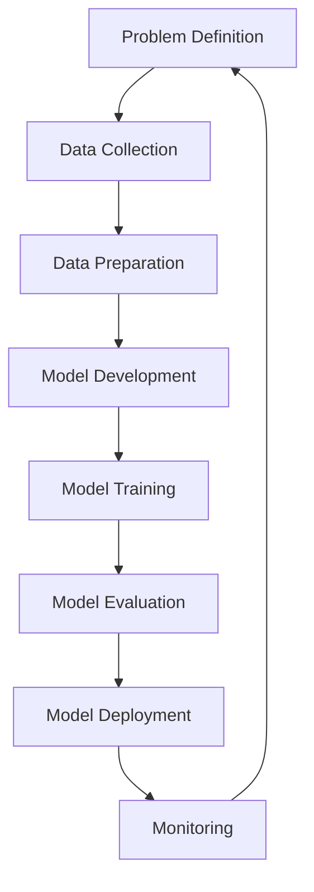

# MLOps Lifecycle: A Comprehensive Guide from Beginner to Advanced

This guide will take you through the complete Machine Learning Operations (MLOps) lifecycle, covering all stages from problem definition to model maintenance, with examples and code snippets.

## Table of Contents
1. [Introduction to MLOps](#introduction-to-mlops)
2. [Problem Definition](#problem-definition)
3. [Data Collection & Preparation](#data-collection--preparation)
4. [Model Development](#model-development)
5. [Model Training](#model-training)
6. [Model Evaluation](#model-evaluation)
7. [Model Deployment](#model-deployment)
8. [Monitoring & Maintenance](#monitoring--maintenance)
9. [Advanced MLOps](#advanced-mlops)
10. [End-to-End Example Project](#end-to-end-example-project)

## Introduction to MLOps

MLOps is the practice of applying DevOps principles to machine learning systems to standardize and streamline the continuous delivery of high-performing models in production.

### Key Differences from Traditional Software:
- Data dependency
- Model decay
- Experiment tracking
- Reproducibility challenges
- Monitoring needs



## Problem Definition

**Objective:** Clearly define the business problem and ML solution approach.

### Key Activities:
- Business objective alignment
- Success metrics definition
- Feasibility assessment
- Resource planning

### Example Problem Charter:

```markdown
# Fraud Detection System

## Business Objective:
Reduce financial losses from fraudulent transactions by 30% within 6 months

## ML Approach:
Binary classification model to flag suspicious transactions

## Success Metrics:
- Precision > 0.9 (to minimize false positives)
- Recall > 0.85 (to catch most fraud cases)
- Inference latency < 100ms

## Constraints:
- Must explain decisions to customers
- Cannot use PII data
- Must comply with GDPR
```

### Example Metrics Definition (YAML):

```yaml
metrics:
  primary:
    name: f1_score
    threshold: 0.88
    direction: maximize
  secondary:
    - name: inference_latency
      threshold: 100ms
      direction: minimize
    - name: model_size
      threshold: 500MB
      direction: minimize
business_impact:
  - metric: false_positives
    cost_per_instance: $5 (customer service)
  - metric: false_negatives
    cost_per_instance: $100 (fraud loss)
```

## Data Collection & Preparation

**Objective:** Gather and process data suitable for model training.

### Key Activities:
- Data sourcing
- Exploratory Data Analysis (EDA)
- Data cleaning
- Feature engineering

### Example Data Pipeline (Python):

```python
# data_pipeline.py
import pandas as pd
from sklearn.model_selection import train_test_split
from sklearn.preprocessing import StandardScaler

def load_data(path):
    """Load and clean raw data"""
    df = pd.read_csv(path)
    df = df.dropna()
    df = df[df['amount'] > 0]  # Remove invalid transactions
    return df

def feature_engineering(df):
    """Create features from raw data"""
    df['hour_of_day'] = pd.to_datetime(df['timestamp']).dt.hour
    df['transaction_size'] = pd.cut(df['amount'], 
                                   bins=[0, 50, 200, 1000, float('inf')],
                                   labels=['small', 'medium', 'large', 'xl'])
    return df

def preprocess_data(df):
    """Prepare data for modeling"""
    X = df.drop(['is_fraud', 'timestamp', 'user_id'], axis=1)
    y = df['is_fraud']
    
    # One-hot encoding for categoricals
    X = pd.get_dummies(X, columns=['merchant_category', 'transaction_size'])
    
    # Train-test split
    X_train, X_test, y_train, y_test = train_test_split(
        X, y, test_size=0.2, stratify=y, random_state=42)
    
    # Scale numerical features
    scaler = StandardScaler()
    num_cols = ['amount', 'hour_of_day']
    X_train[num_cols] = scaler.fit_transform(X_train[num_cols])
    X_test[num_cols] = scaler.transform(X_test[num_cols])
    
    return X_train, X_test, y_train, y_test, scaler
```

### Example Data Validation (Great Expectations):

```python
# data_validation.py
import great_expectations as ge

def validate_data(df):
    """Run data quality checks"""
    suite = ge.dataset.PandasDataset(df)
    
    # Expectation suite
    suite.expect_column_values_to_not_be_null('transaction_id')
    suite.expect_column_values_to_be_between('amount', 0.01, 100000)
    suite.expect_column_values_to_be_in_set('currency', ['USD', 'EUR', 'GBP'])
    suite.expect_column_values_to_be_unique('transaction_id')
    
    # Save validation results
    validation_result = suite.validate()
    return validation_result
```

## Model Development

**Objective:** Design and implement machine learning models.

### Key Activities:
- Algorithm selection
- Baseline model creation
- Experiment tracking
- Hyperparameter tuning

### Example Model Training (Python):

```python
# model_training.py
from sklearn.ensemble import RandomForestClassifier
from sklearn.metrics import classification_report
from sklearn.model_selection import GridSearchCV
import mlflow
import mlflow.sklearn

def train_model(X_train, y_train):
    """Train and optimize model"""
    with mlflow.start_run():
        # Log parameters
        mlflow.log_param("model_type", "RandomForest")
        
        # Hyperparameter tuning
        param_grid = {
            'n_estimators': [100, 200],
            'max_depth': [10, 20, None],
            'min_samples_leaf': [1, 2]
        }
        
        model = GridSearchCV(
            RandomForestClassifier(class_weight='balanced'),
            param_grid,
            cv=5,
            scoring='f1'
        )
        model.fit(X_train, y_train)
        
        # Log metrics and model
        mlflow.log_metrics({
            'best_cv_score': model.best_score_,
            'best_params': model.best_params_
        })
        mlflow.sklearn.log_model(model.best_estimator_, "model")
        
        return model.best_estimator_
```

### Example Experiment Tracking (MLflow):

```python
# experiment_tracking.py
import mlflow

def track_experiments():
    mlflow.set_tracking_uri("http://localhost:5000")
    mlflow.set_experiment("Fraud Detection")
    
    # Define parameters to test
    params_to_test = {
        'n_estimators': [50, 100, 150],
        'criterion': ['gini', 'entropy']
    }
    
    for n in params_to_test['n_estimators']:
        for crit in params_to_test['criterion']:
            with mlflow.start_run():
                model = RandomForestClassifier(
                    n_estimators=n,
                    criterion=crit,
                    n_jobs=-1
                )
                model.fit(X_train, y_train)
                preds = model.predict(X_test)
                f1 = f1_score(y_test, preds)
                
                # Log parameters and metrics
                mlflow.log_param("n_estimators", n)
                mlflow.log_param("criterion", crit)
                mlflow.log_metric("f1_score", f1)
                mlflow.sklearn.log_model(model, "model")
```

## Model Evaluation

**Objective:** Assess model performance and suitability for deployment.

### Key Activities:
- Metric calculation
- Error analysis
- Fairness assessment
- Business impact analysis

### Example Evaluation Script:

```python
# model_evaluation.py
from sklearn.metrics import classification_report, confusion_matrix, roc_auc_score
import matplotlib.pyplot as plt
import seaborn as sns

def evaluate_model(model, X_test, y_test):
    """Comprehensive model evaluation"""
    # Generate predictions
    y_pred = model.predict(X_test)
    y_proba = model.predict_proba(X_test)[:, 1]
    
    # Classification report
    print("Classification Report:")
    print(classification_report(y_test, y_pred))
    
    # Confusion matrix
    cm = confusion_matrix(y_test, y_pred)
    plt.figure(figsize=(8, 6))
    sns.heatmap(cm, annot=True, fmt='d', cmap='Blues')
    plt.title('Confusion Matrix')
    plt.xlabel('Predicted')
    plt.ylabel('Actual')
    plt.savefig('confusion_matrix.png')
    plt.close()
    
    # ROC AUC
    roc_auc = roc_auc_score(y_test, y_proba)
    print(f"ROC AUC Score: {roc_auc:.4f}")
    
    # Feature importance
    if hasattr(model, 'feature_importances_'):
        feat_importances = pd.Series(
            model.feature_importances_,
            index=X_test.columns
        )
        feat_importances.nlargest(10).plot(kind='barh')
        plt.title('Top 10 Feature Importances')
        plt.savefig('feature_importances.png')
        plt.close()
    
    return {
        'classification_report': classification_report(y_test, y_pred, output_dict=True),
        'roc_auc': roc_auc,
        'confusion_matrix': cm.tolist()
    }
```

### Example Fairness Assessment:

```python
# fairness_assessment.py
from aif360.metrics import ClassificationMetric
from aif360.datasets import BinaryLabelDataset

def assess_fairness(model, X_test, y_test, protected_attribute):
    """Evaluate model fairness across protected groups"""
    # Convert to AIF360 dataset format
    dataset = BinaryLabelDataset(
        df=X_test.assign(label=y_test),
        label_names=['label'],
        protected_attribute_names=[protected_attribute]
    )
    
    # Get model predictions
    preds = model.predict(X_test)
    dataset_pred = dataset.copy()
    dataset_pred.labels = preds.reshape(-1, 1)
    
    # Calculate metrics
    metric = ClassificationMetric(
        dataset,
        dataset_pred,
        unprivileged_groups=[{protected_attribute: 0}],
        privileged_groups=[{protected_attribute: 1}]
    )
    
    return {
        'disparate_impact': metric.disparate_impact(),
        'statistical_parity_difference': metric.statistical_parity_difference(),
        'equal_opportunity_difference': metric.equal_opportunity_difference(),
        'average_odds_difference': metric.average_odds_difference()
    }
```

## Model Deployment

**Objective:** Package and deploy model for production use.

### Deployment Options:
- Batch prediction
- Real-time API
- Edge deployment
- Serverless functions

### Example Model Packaging (MLflow):

```python
# model_packaging.py
import mlflow.pyfunc

class FraudDetectionModel(mlflow.pyfunc.PythonModel):
    def __init__(self, model, scaler):
        self.model = model
        self.scaler = scaler
        
    def predict(self, context, model_input):
        # Preprocess input
        model_input = model_input.copy()
        model_input['hour_of_day'] = pd.to_datetime(model_input['timestamp']).dt.hour
        model_input = pd.get_dummies(model_input, 
                                   columns=['merchant_category'])
        
        # Scale numerical features
        num_cols = ['amount', 'hour_of_day']
        model_input[num_cols] = self.scaler.transform(model_input[num_cols])
        
        # Make prediction
        return self.model.predict_proba(model_input)[:, 1]

# Save packaged model
mlflow.pyfunc.save_model(
    path="fraud_detection_model",
    python_model=FraudDetectionModel(model, scaler),
    conda_env="conda.yaml",
    artifacts={}
)
```

### Example Deployment (FastAPI):

```python
# app.py
from fastapi import FastAPI
from pydantic import BaseModel
import pandas as pd
import mlflow.pyfunc

app = FastAPI()

# Load model
model = mlflow.pyfunc.load_model("fraud_detection_model")

class Transaction(BaseModel):
    transaction_id: str
    amount: float
    timestamp: str
    merchant_category: str
    currency: str

@app.post("/predict")
async def predict(transaction: Transaction):
    # Convert to DataFrame
    input_data = pd.DataFrame([transaction.dict()])
    
    # Make prediction
    fraud_prob = model.predict(input_data)[0]
    
    return {
        "transaction_id": transaction.transaction_id,
        "fraud_probability": float(fraud_prob),
        "is_fraud": bool(fraud_prob > 0.5)  # Using 0.5 threshold
    }
```

### Example Kubernetes Deployment (YAML):

```yaml
# deployment.yaml
apiVersion: apps/v1
kind: Deployment
metadata:
  name: fraud-detection-api
spec:
  replicas: 3
  selector:
    matchLabels:
      app: fraud-detection
  template:
    metadata:
      labels:
        app: fraud-detection
    spec:
      containers:
      - name: fraud-detection
        image: your-registry/fraud-detection:latest
        ports:
        - containerPort: 8000
        resources:
          requests:
            cpu: "500m"
            memory: "512Mi"
          limits:
            cpu: "1000m"
            memory: "1Gi"
        env:
        - name: MODEL_PATH
          value: "/models/fraud-detection"
---
apiVersion: v1
kind: Service
metadata:
  name: fraud-detection-service
spec:
  selector:
    app: fraud-detection
  ports:
    - protocol: TCP
      port: 80
      targetPort: 8000
```

## Monitoring & Maintenance

**Objective:** Track model performance and maintain its effectiveness.

### Key Activities:
- Performance drift detection
- Data drift detection
- Concept drift detection
- Model retraining

### Example Monitoring Dashboard (Prometheus + Grafana):

```python
# monitoring.py
from prometheus_client import start_http_server, Gauge
import time
import requests

# Create metrics
PREDICTION_GAUGE = Gauge('model_predictions_total', 'Total predictions')
FRAUD_GAUGE = Gauge('fraud_predictions_total', 'Fraud predictions')
LATENCY_GAUGE = Gauge('prediction_latency_seconds', 'Prediction latency')
SCORE_GAUGE = Gauge('model_f1_score', 'Current F1 score')

def monitor_model():
    start_http_server(8000)
    
    while True:
        # Sample monitoring data (in reality would come from logs/DB)
        try:
            response = requests.get('http://model-service/metrics')
            metrics = response.json()
            
            # Update metrics
            PREDICTION_GAUGE.set(metrics['total_predictions'])
            FRAUD_GAUGE.set(metrics['fraud_predictions'])
            LATENCY_GAUGE.set(metrics['avg_latency'])
            SCORE_GAUGE.set(metrics['current_f1'])
            
        except Exception as e:
            print(f"Monitoring error: {e}")
        
        time.sleep(60)
```

### Example Drift Detection:

```python
# drift_detection.py
from alibi_detect import KSDrift, ChiSquareDrift
import numpy as np

def detect_drift(reference_data, current_data):
    """Detect data drift between reference and current data"""
    # Initialize drift detector
    drift_detector = KSDrift(
        p_val=0.05,
        X_ref=reference_data
    )
    
    # Check for drift
    drift_preds = drift_detector.predict(current_data)
    
    return {
        'is_drift': bool(drift_preds['data']['is_drift']),
        'p_val': float(drift_preds['data']['p_val']),
        'threshold': float(drift_preds['data']['threshold'])
    }

def detect_concept_drift(y_true, y_pred):
    """Detect concept drift by monitoring performance"""
    accuracy = np.mean(y_true == y_pred)
    return {
        'current_accuracy': float(accuracy),
        'warning': bool(accuracy < 0.85)  # Example threshold
    }
```

## Advanced MLOps

### Feature Store Implementation:

```python
# feature_store.py
from feast import FeatureStore, Entity, ValueType
from feast import Feature, FeatureView, FileSource
from datetime import timedelta

# Define entities
user = Entity(name="user_id", value_type=ValueType.INT64)

# Define data sources
user_stats_source = FileSource(
    path="user_stats.parquet",
    event_timestamp_column="timestamp"
)

# Define feature views
user_stats_view = FeatureView(
    name="user_stats",
    entities=["user_id"],
    ttl=timedelta(days=365),
    features=[
        Feature(name="avg_transaction", dtype=ValueType.FLOAT),
        Feature(name="transaction_count_7d", dtype=ValueType.INT64),
        Feature(name="fraud_count_30d", dtype=ValueType.INT64)
    ],
    online=True,
    input=user_stats_source
)

# Create feature store
store = FeatureStore("./feature_repo")
store.apply([user, user_stats_view])
```

### Model CI/CD Pipeline (GitHub Actions):

```yaml
name: MLOps Pipeline

on:
  push:
    branches: [ main ]
  pull_request:
    branches: [ main ]

jobs:
  data-validation:
    runs-on: ubuntu-latest
    steps:
    - uses: actions/checkout@v2
    - name: Set up Python
      uses: actions/setup-python@v2
      with:
        python-version: '3.8'
    - name: Validate data
      run: |
        pip install great-expectations
        python data_validation.py
        
  train-model:
    needs: data-validation
    runs-on: ubuntu-latest
    steps:
    - uses: actions/checkout@v2
    - name: Set up Python
      uses: actions/setup-python@v2
      with:
        python-version: '3.8'
    - name: Train model
      run: |
        pip install -r requirements.txt
        python model_training.py
    - name: Evaluate model
      run: python model_evaluation.py
    - name: Upload model
      uses: actions/upload-artifact@v2
      with:
        name: model
        path: model/
        
  deploy:
    needs: train-model
    runs-on: ubuntu-latest
    steps:
    - uses: actions/checkout@v2
    - name: Download model
      uses: actions/download-artifact@v2
      with:
        name: model
        path: model/
    - name: Deploy to staging
      run: |
        docker build -t fraud-detection-model .
        docker push your-registry/fraud-detection-model:latest
        kubectl apply -f deployment.yaml
```

## End-to-End Example Project

### Fraud Detection System Implementation

**1. Problem Definition:**
- Detect fraudulent credit card transactions in real-time
- Minimize false positives to avoid customer friction
- Explainable decisions for regulatory compliance

**2. Data Pipeline:**

```python
# data_pipeline.py
def create_training_data():
    # Load raw transactions
    transactions = pd.read_parquet('transactions.parquet')
    
    # Feature engineering
    transactions['hour'] = transactions['timestamp'].dt.hour
    transactions['day_of_week'] = transactions['timestamp'].dt.dayofweek
    transactions['amount_log'] = np.log(transactions['amount'] + 1)
    
    # Aggregate user features
    user_stats = transactions.groupby('user_id').agg({
        'amount': ['mean', 'std', 'count'],
        'is_fraud': 'sum'
    }).reset_index()
    user_stats.columns = ['user_id', 'avg_amount', 'std_amount', 
                        'tx_count', 'fraud_count']
    
    # Merge features
    data = pd.merge(transactions, user_stats, on='user_id')
    
    return data
```

**3. Model Training with MLflow:**

```python
# train.py
import xgboost as xgb
from sklearn.model_selection import TimeSeriesSplit
import mlflow

def train_with_mlflow():
    mlflow.set_tracking_uri("http://mlflow-server:5000")
    mlflow.set_experiment("Fraud Detection")
    
    data = create_training_data()
    X = data.drop(['is_fraud', 'timestamp'], axis=1)
    y = data['is_fraud']
    
    with mlflow.start_run():
        # Time-series cross-validation
        tscv = TimeSeriesSplit(n_splits=5)
        
        for fold, (train_idx, val_idx) in enumerate(tscv.split(X)):
            X_train, X_val = X.iloc[train_idx], X.iloc[val_idx]
            y_train, y_val = y.iloc[train_idx], y.iloc[val_idx]
            
            # Train XGBoost model
            model = xgb.XGBClassifier(
                objective='binary:logistic',
                eval_metric='aucpr',
                scale_pos_weight=100  # Account for class imbalance
            )
            model.fit(
                X_train, y_train,
                eval_set=[(X_val, y_val)],
                verbose=False
            )
            
            # Log metrics
            val_preds = model.predict_proba(X_val)[:, 1]
            auc = roc_auc_score(y_val, val_preds)
            mlflow.log_metric(f"fold_{fold}_auc", auc)
        
        # Log final model and parameters
        mlflow.xgboost.log_model(model, "model")
        mlflow.log_params(model.get_params())
```

**4. Model Serving with FastAPI and Docker:**

```dockerfile
# Dockerfile
FROM python:3.8-slim

WORKDIR /app

COPY requirements.txt .
RUN pip install -r requirements.txt

COPY . .

CMD ["uvicorn", "app:app", "--host", "0.0.0.0", "--port", "8000"]
```

```python
# app.py
from fastapi import FastAPI
from pydantic import BaseModel
import pandas as pd
import mlflow.pyfunc

app = FastAPI()

# Load model
model = mlflow.pyfunc.load_model("model")

class Transaction(BaseModel):
    transaction_id: str
    user_id: str
    amount: float
    merchant: str
    timestamp: str

@app.post("/score")
async def score_transaction(tx: Transaction):
    # Convert to features
    features = pd.DataFrame([{
        'amount': tx.amount,
        'merchant': tx.merchant,
        'hour': pd.to_datetime(tx.timestamp).hour,
        'user_id': tx.user_id  # Will be joined with user features in production
    }])
    
    # Get prediction
    score = model.predict(features)[0]
    
    return {
        "transaction_id": tx.transaction_id,
        "fraud_score": score,
        "is_fraud": score > 0.7  # Business-defined threshold
    }
```

**5. Monitoring Implementation:**

```python
# monitor.py
from prometheus_client import start_http_server, Summary, Counter
import time
import random

# Create metrics
REQUEST_TIME = Summary('request_processing_seconds', 'Time spent processing request')
FRAUD_PREDICTIONS = Counter('fraud_predictions_total', 'Total fraud predictions')
NON_FRAUD_PREDICTIONS = Counter('non_fraud_predictions_total', 'Total non-fraud predictions')

@REQUEST_TIME.time()
def process_request(tx):
    # Simulate processing
    time.sleep(random.random())
    
    # Random prediction for example
    is_fraud = random.random() > 0.95  # 5% fraud rate
    
    if is_fraud:
        FRAUD_PREDICTIONS.inc()
    else:
        NON_FRAUD_PREDICTIONS.inc()
    
    return is_fraud

if __name__ == '__main__':
    start_http_server(8000)
    
    while True:
        process_request({})
        time.sleep(1)
```

**6. Continuous Retraining Pipeline:**

```python
# retraining_pipeline.py
import schedule
import time
from datetime import datetime
import mlflow

def retrain_job():
    print(f"{datetime.now()}: Starting retraining job")
    
    try:
        # 1. Get new data
        new_data = get_new_transactions()
        
        # 2. Check for drift
        drift_results = check_data_drift(new_data)
        
        if drift_results['needs_retraining']:
            # 3. Retrain model
            with mlflow.start_run(run_name="scheduled_retraining"):
                model = train_model(new_data)
                
                # 4. Evaluate
                eval_results = evaluate_model(model)
                
                if eval_results['f1'] > 0.85:  # Quality threshold
                    # 5. Deploy new model
                    deploy_model(model)
                    print("New model deployed successfully")
                else:
                    print("New model didn't meet quality standards")
        else:
            print("No significant drift detected")
            
    except Exception as e:
        print(f"Retraining failed: {e}")

# Schedule to run weekly
schedule.every().week.do(retrain_job)

while True:
    schedule.run_pending()
    time.sleep(3600)  # Check every hour
```

## Conclusion

This guide has walked you through the complete MLOps lifecycle from problem definition to continuous monitoring and retraining. MLOps is an iterative process that requires collaboration between data scientists, engineers, and business stakeholders.

### Key Takeaways:
1. MLOps extends DevOps principles to machine learning systems
2. Reproducibility and versioning are crucial for all components (data, code, models)
3. Continuous monitoring is essential due to model decay
4. Automation reduces friction in the model lifecycle
5. Collaboration between roles is necessary for success

### Next Steps:
1. Implement your own MLOps pipeline with a simple project
2. Explore specialized MLOps tools (MLflow, Kubeflow, TFX)
3. Learn about advanced topics like canary deployments and shadow mode
4. Practice with different deployment scenarios (batch vs real-time)
5. Stay updated with the evolving MLOps ecosystem

Remember that MLOps is as much about culture and processes as it is about technology. Happy modeling!