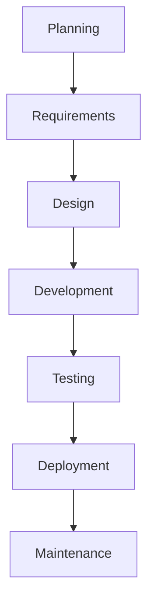
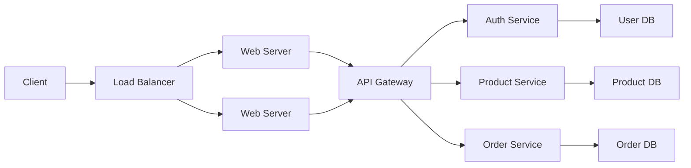
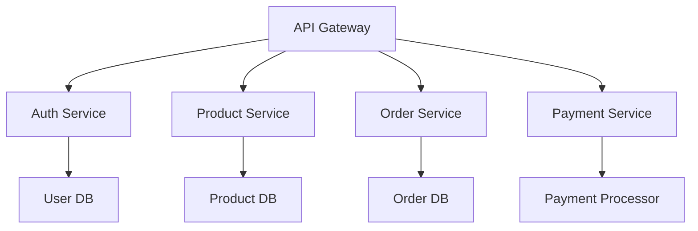
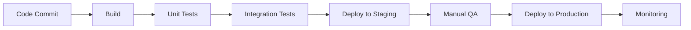

# Full Stack Software Development Life Cycle: A Comprehensive Guide

This guide will take you from beginner to advanced understanding of the full stack software development life cycle (SDLC), with examples and code snippets along the way.

## Table of Contents
1. [Introduction to SDLC](#introduction-to-sdlc)
2. [Planning Phase](#planning-phase)
3. [Requirement Analysis](#requirement-analysis)
4. [Design Phase](#design-phase)
5. [Development Phase](#development-phase)
6. [Testing Phase](#testing-phase)
7. [Deployment Phase](#deployment-phase)
8. [Maintenance Phase](#maintenance-phase)
9. [Advanced Topics](#advanced-topics)
10. [Full Stack Example Project](#full-stack-example-project)

## Introduction to SDLC

The Software Development Life Cycle (SDLC) is a process used by the software industry to design, develop, and test high-quality software. For full stack development, this involves both frontend and backend components.

### SDLC Models
- Waterfall
- Agile (Scrum, Kanban)
- DevOps
- Spiral
- V-Model



## Planning Phase

**Objective:** Define the scope, purpose, and feasibility of the project.

### Key Activities:
- Project charter
- Feasibility study
- Resource planning
- Risk assessment

### Example Project Plan (Markdown):

```markdown
# Project: E-commerce Platform

## Goals:
- Allow users to browse products
- Enable online purchases
- Admin dashboard for inventory

## Timeline:
- Requirements: 2 weeks
- Design: 3 weeks
- Development: 8 weeks
- Testing: 3 weeks
- Deployment: 1 week

## Team:
- 2 Frontend developers
- 2 Backend developers
- 1 QA engineer
- 1 DevOps
```

## Requirement Analysis

**Objective:** Gather and document what the software should do.

### Techniques:
- Interviews
- Surveys
- User stories
- Use cases

### Example User Story (Agile):

```markdown
**Title:** User Registration

**As a** new customer
**I want to** create an account
**So that** I can make purchases and track orders

**Acceptance Criteria:**
- Email validation
- Password strength requirements
- Confirmation email sent
```

### Example Requirements Document:

```json
{
  "functionalRequirements": [
    {
      "id": "FR-001",
      "description": "User registration",
      "priority": "High",
      "components": ["frontend", "backend", "database"]
    },
    {
      "id": "FR-002",
      "description": "Product search",
      "priority": "High",
      "components": ["frontend", "backend"]
    }
  ],
  "nonFunctionalRequirements": {
    "performance": "Page load < 2s",
    "security": "PCI DSS compliant"
  }
}
```

## Design Phase

**Objective:** Create architecture and design documents.

### Components:
1. **System Architecture**
2. **Database Design**
3. **UI/UX Design**
4. **API Design**

### Example System Architecture Diagram:



### Example Database Schema (SQL):

```sql
CREATE TABLE users (
    id SERIAL PRIMARY KEY,
    email VARCHAR(255) UNIQUE NOT NULL,
    password_hash VARCHAR(255) NOT NULL,
    created_at TIMESTAMP DEFAULT NOW()
);

CREATE TABLE products (
    id SERIAL PRIMARY KEY,
    name VARCHAR(255) NOT NULL,
    price DECIMAL(10,2) NOT NULL,
    stock INTEGER NOT NULL
);

CREATE TABLE orders (
    id SERIAL PRIMARY KEY,
    user_id INTEGER REFERENCES users(id),
    total DECIMAL(10,2) NOT NULL,
    status VARCHAR(50) NOT NULL,
    created_at TIMESTAMP DEFAULT NOW()
);
```

### Example API Design (OpenAPI/Swagger):

```yaml
openapi: 3.0.0
info:
  title: E-commerce API
  version: 1.0.0

paths:
  /api/products:
    get:
      summary: Get all products
      responses:
        '200':
          description: List of products
          content:
            application/json:
              schema:
                type: array
                items:
                  $ref: '#/components/schemas/Product'
  
components:
  schemas:
    Product:
      type: object
      properties:
        id:
          type: integer
        name:
          type: string
        price:
          type: number
          format: float
```

## Development Phase

**Objective:** Write the actual code for both frontend and backend.

### Frontend Development (React Example):

```jsx
// ProductList.js
import React, { useState, useEffect } from 'react';
import axios from 'axios';

function ProductList() {
  const [products, setProducts] = useState([]);
  
  useEffect(() => {
    axios.get('/api/products')
      .then(response => setProducts(response.data))
      .catch(error => console.error(error));
  }, []);

  return (
    <div className="product-list">
      <h2>Products</h2>
      <ul>
        {products.map(product => (
          <li key={product.id}>
            {product.name} - ${product.price}
          </li>
        ))}
      </ul>
    </div>
  );
}

export default ProductList;
```

### Backend Development (Node.js/Express Example):

```javascript
// server.js
const express = require('express');
const bodyParser = require('body-parser');
const { Pool } = require('pg');

const app = express();
app.use(bodyParser.json());

const pool = new Pool({
  user: 'dbuser',
  host: 'database.server.com',
  database: 'ecommerce',
  password: 'secretpassword',
  port: 5432,
});

// Get all products
app.get('/api/products', async (req, res) => {
  try {
    const { rows } = await pool.query('SELECT * FROM products');
    res.json(rows);
  } catch (err) {
    console.error(err);
    res.status(500).send('Server error');
  }
});

const PORT = process.env.PORT || 5000;
app.listen(PORT, () => console.log(`Server running on port ${PORT}`));
```

## Testing Phase

**Objective:** Verify that the software meets requirements and is bug-free.

### Types of Testing:
1. Unit Testing
2. Integration Testing
3. System Testing
4. Acceptance Testing

### Example Unit Test (Jest):

```javascript
// product.test.js
const { calculateTotal } = require('./orderService');

describe('Order Service', () => {
  test('calculates total correctly', () => {
    const items = [
      { price: 10, quantity: 2 },
      { price: 15, quantity: 1 }
    ];
    expect(calculateTotal(items)).toBe(35);
  });
});
```

### Example Integration Test (Postman):

```javascript
// Postman test script
pm.test("Status code is 200", function () {
    pm.response.to.have.status(200);
});

pm.test("Response has products array", function () {
    const jsonData = pm.response.json();
    pm.expect(jsonData).to.be.an('array');
});
```

## Deployment Phase

**Objective:** Release the software to production.

### Deployment Pipeline Example (GitHub Actions):

```yaml
name: Node.js CI/CD

on:
  push:
    branches: [ main ]

jobs:
  build:
    runs-on: ubuntu-latest
    
    steps:
    - uses: actions/checkout@v2
    
    - name: Install dependencies
      run: npm install
      
    - name: Run tests
      run: npm test
      
    - name: Build for production
      run: npm run build
      
    - name: Deploy to AWS
      uses: aws-actions/configure-aws-credentials@v1
      with:
        aws-access-key-id: ${{ secrets.AWS_ACCESS_KEY_ID }}
        aws-secret-access-key: ${{ secrets.AWS_SECRET_ACCESS_KEY }}
        aws-region: us-east-1
        
    - name: Deploy with Serverless
      run: sls deploy
```

### Docker Configuration Example:

```dockerfile
# Dockerfile
FROM node:14

WORKDIR /app

COPY package*.json ./
RUN npm install

COPY . .

EXPOSE 3000
CMD ["npm", "start"]
```

## Maintenance Phase

**Objective:** Keep the software running smoothly after deployment.

### Activities:
- Bug fixes
- Performance optimization
- Security updates
- Feature additions

### Example Bug Fix Workflow:

1. User reports bug via issue tracker
2. Developer reproduces the issue
3. Fix is implemented and tested
4. Fix is deployed via CI/CD pipeline
5. User verifies the fix

### Example Performance Optimization:

```javascript
// Before: O(n^2) complexity
function findDuplicates(arr) {
  let duplicates = [];
  for (let i = 0; i < arr.length; i++) {
    for (let j = i + 1; j < arr.length; j++) {
      if (arr[i] === arr[j]) {
        duplicates.push(arr[i]);
      }
    }
  }
  return duplicates;
}

// After: O(n) complexity
function findDuplicatesOptimized(arr) {
  let seen = new Set();
  let duplicates = new Set();
  
  arr.forEach(item => {
    if (seen.has(item)) {
      duplicates.add(item);
    } else {
      seen.add(item);
    }
  });
  
  return Array.from(duplicates);
}
```

## Advanced Topics

### Microservices Architecture



### CI/CD Pipeline



### Serverless Example (AWS Lambda):

```javascript
// lambda/handler.js
exports.handler = async (event) => {
  const { name } = JSON.parse(event.body);
  
  const response = {
    statusCode: 200,
    body: JSON.stringify(`Hello ${name}`),
  };
  
  return response;
};
```

## Full Stack Example Project

Let's build a simple task manager application through all SDLC phases.

### 1. Planning
- Simple task management
- User authentication
- REST API backend
- React frontend

### 2. Requirements
- Users can create, read, update, delete tasks
- Tasks have title, description, status
- User registration/login

### 3. Design
**Database Schema:**
```sql
CREATE TABLE users (
  id SERIAL PRIMARY KEY,
  username TEXT UNIQUE NOT NULL,
  password TEXT NOT NULL
);

CREATE TABLE tasks (
  id SERIAL PRIMARY KEY,
  user_id INTEGER REFERENCES users(id),
  title TEXT NOT NULL,
  description TEXT,
  status TEXT DEFAULT 'pending',
  created_at TIMESTAMP DEFAULT NOW()
);
```

**API Endpoints:**
- POST /api/register
- POST /api/login
- GET /api/tasks
- POST /api/tasks
- PUT /api/tasks/:id
- DELETE /api/tasks/:id

### 4. Development

**Backend (Node.js/Express):**
```javascript
// server.js
const express = require('express');
const bcrypt = require('bcryptjs');
const jwt = require('jsonwebtoken');
const { Pool } = require('pg');

const app = express();
app.use(express.json());

const pool = new Pool({ /* config */ });

// JWT secret
const JWT_SECRET = 'your-secret-key';

// Register endpoint
app.post('/api/register', async (req, res) => {
  const { username, password } = req.body;
  const hashedPassword = await bcrypt.hash(password, 10);
  
  try {
    const { rows } = await pool.query(
      'INSERT INTO users (username, password) VALUES ($1, $2) RETURNING id',
      [username, hashedPassword]
    );
    res.status(201).json({ userId: rows[0].id });
  } catch (err) {
    res.status(400).json({ error: 'Username already exists' });
  }
});

// Login endpoint
app.post('/api/login', async (req, res) => {
  const { username, password } = req.body;
  
  const { rows } = await pool.query(
    'SELECT * FROM users WHERE username = $1',
    [username]
  );
  
  if (rows.length === 0 || !await bcrypt.compare(password, rows[0].password)) {
    return res.status(401).json({ error: 'Invalid credentials' });
  }
  
  const token = jwt.sign({ userId: rows[0].id }, JWT_SECRET);
  res.json({ token });
});

// Protected routes middleware
function authenticate(req, res, next) {
  const token = req.headers.authorization?.split(' ')[1];
  if (!token) return res.status(401).json({ error: 'Unauthorized' });
  
  try {
    const decoded = jwt.verify(token, JWT_SECRET);
    req.userId = decoded.userId;
    next();
  } catch (err) {
    res.status(401).json({ error: 'Invalid token' });
  }
}

// Get all tasks for user
app.get('/api/tasks', authenticate, async (req, res) => {
  const { rows } = await pool.query(
    'SELECT * FROM tasks WHERE user_id = $1',
    [req.userId]
  );
  res.json(rows);
});

// Other CRUD endpoints would follow similar patterns...

const PORT = process.env.PORT || 5000;
app.listen(PORT, () => console.log(`Server running on port ${PORT}`));
```

**Frontend (React):**
```jsx
// App.js
import React, { useState, useEffect } from 'react';
import axios from 'axios';

function App() {
  const [tasks, setTasks] = useState([]);
  const [user, setUser] = useState(null);
  
  const fetchTasks = async () => {
    try {
      const token = localStorage.getItem('token');
      const response = await axios.get('/api/tasks', {
        headers: { Authorization: `Bearer ${token}` }
      });
      setTasks(response.data);
    } catch (error) {
      console.error('Failed to fetch tasks', error);
    }
  };
  
  const handleLogin = async (credentials) => {
    try {
      const response = await axios.post('/api/login', credentials);
      localStorage.setItem('token', response.data.token);
      setUser({ username: credentials.username });
      fetchTasks();
    } catch (error) {
      console.error('Login failed', error);
    }
  };
  
  useEffect(() => {
    const token = localStorage.getItem('token');
    if (token) {
      // Verify token and fetch user data in a real app
      fetchTasks();
    }
  }, []);
  
  return (
    <div className="App">
      {!user ? (
        <LoginForm onLogin={handleLogin} />
      ) : (
        <div>
          <h1>Welcome, {user.username}</h1>
          <TaskList tasks={tasks} />
          <AddTaskForm onAdd={fetchTasks} />
        </div>
      )}
    </div>
  );
}

export default App;
```

### 5. Testing
**Backend Test (Jest):**
```javascript
const request = require('supertest');
const app = require('../server');
const { pool } = require('../db');

describe('Task API', () => {
  let authToken;
  
  beforeAll(async () => {
    // Setup test user
    await pool.query(
      'INSERT INTO users (username, password) VALUES ($1, $2)',
      ['testuser', 'hashedpassword']
    );
    
    // Login to get token
    const res = await request(app)
      .post('/api/login')
      .send({ username: 'testuser', password: 'password' });
    
    authToken = res.body.token;
  });
  
  test('GET /api/tasks', async () => {
    const res = await request(app)
      .get('/api/tasks')
      .set('Authorization', `Bearer ${authToken}`);
    
    expect(res.statusCode).toEqual(200);
    expect(Array.isArray(res.body)).toBeTruthy();
  });
  
  afterAll(async () => {
    await pool.query('DELETE FROM users WHERE username = $1', ['testuser']);
    await pool.end();
  });
});
```

### 6. Deployment
**Docker Compose:**
```yaml
version: '3'

services:
  db:
    image: postgres
    environment:
      POSTGRES_PASSWORD: example
      POSTGRES_DB: taskmanager
    volumes:
      - postgres_data:/var/lib/postgresql/data
  
  backend:
    build: ./backend
    ports:
      - "5000:5000"
    environment:
      DB_HOST: db
      DB_USER: postgres
      DB_PASSWORD: example
      DB_NAME: taskmanager
    depends_on:
      - db
  
  frontend:
    build: ./frontend
    ports:
      - "3000:3000"
    depends_on:
      - backend

volumes:
  postgres_data:
```

### 7. Maintenance
- Monitor for errors
- Add new features (due dates, categories)
- Optimize performance as user base grows

## Conclusion

This guide has walked you through the complete full stack software development life cycle from planning to maintenance. Remember that SDLC is iterative - you'll often cycle back through phases as you refine and improve your application.

### Next Steps:
1. Practice with your own projects
2. Learn about different architectural patterns
3. Explore DevOps practices
4. Study advanced database concepts
5. Keep up with new frameworks and technologies

Happy coding!